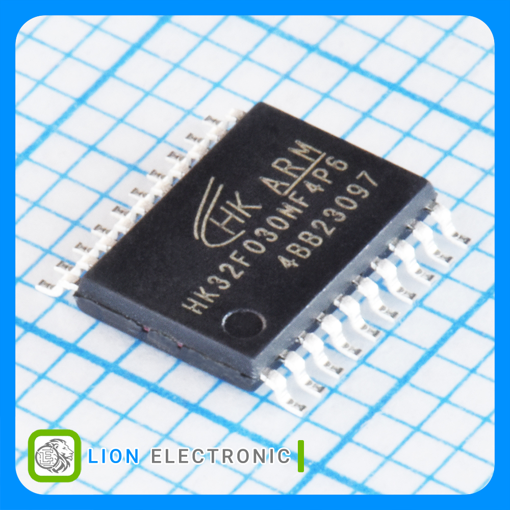

1- install device pack for keil or iar

2- compile example project and upload code to mcu with programmer tool : stlink v2 - jlink - power writer

3- supported programming tool : stlink v2 - Segger jlink - PWLINK2

Microcontroller purchase link :   
      [HK32F030MF4P6](https://lionelectronic.ir/products/2668-HK32F030MF4P6)  
      [HK32F0301MF4P6](https://lionelectronic.ir/products/5533-HK32F0301MF4P6)  
      [HK32F030MF4U6](https://lionelectronic.ir/products/5532-HK32F030MF4U6)  
      [HK32C030K8U7](https://lionelectronic.ir/products/6003-HK32C030K8U7)  
      [HK32F103CBT6](https://lionelectronic.ir/products/6162-HK32F103CBT6)  

---

  

---
